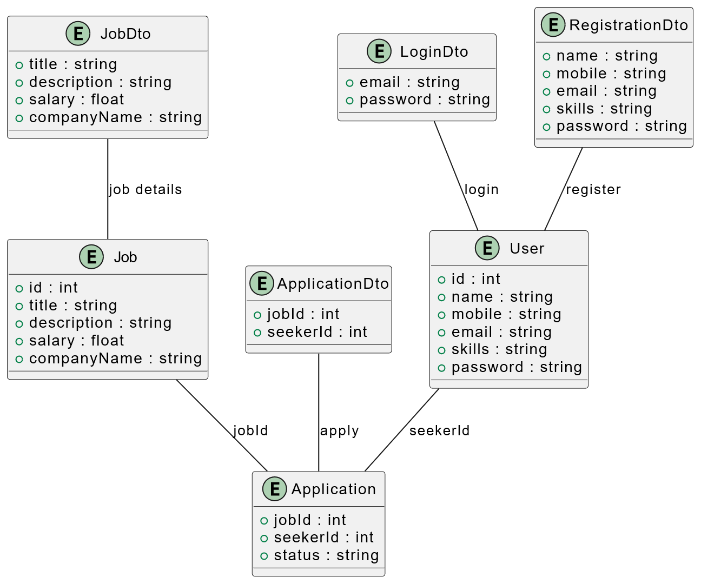
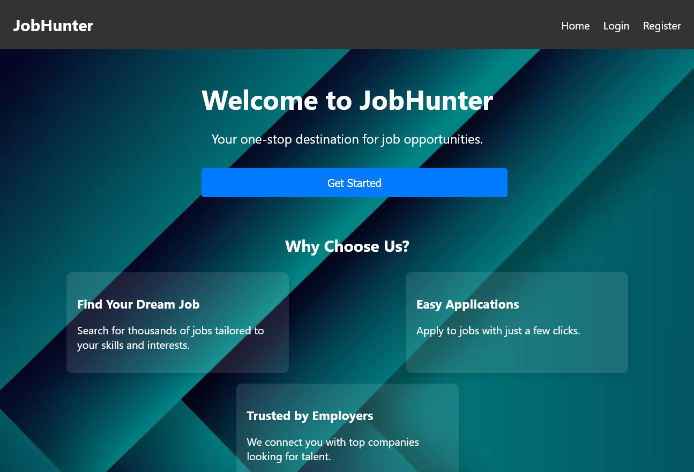
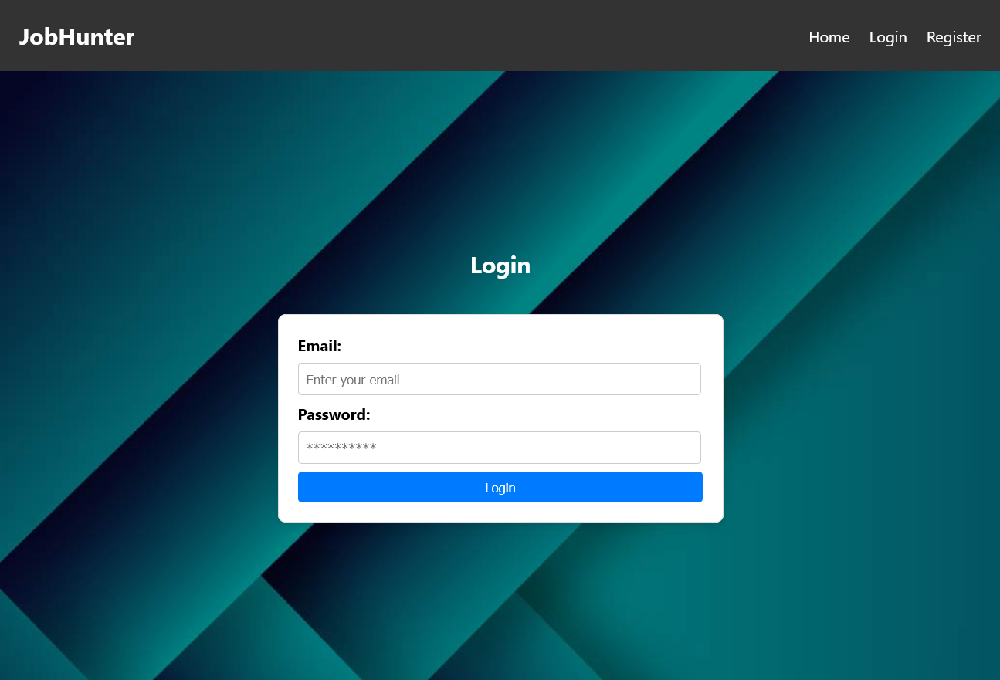
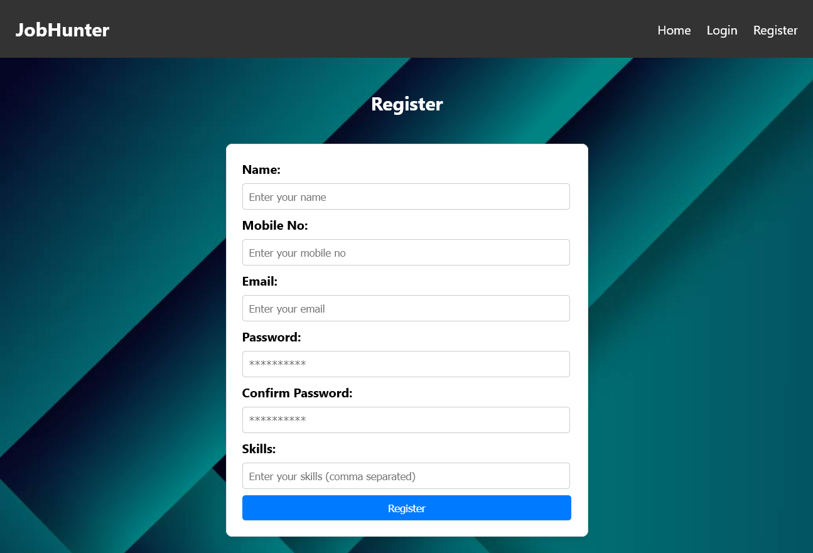
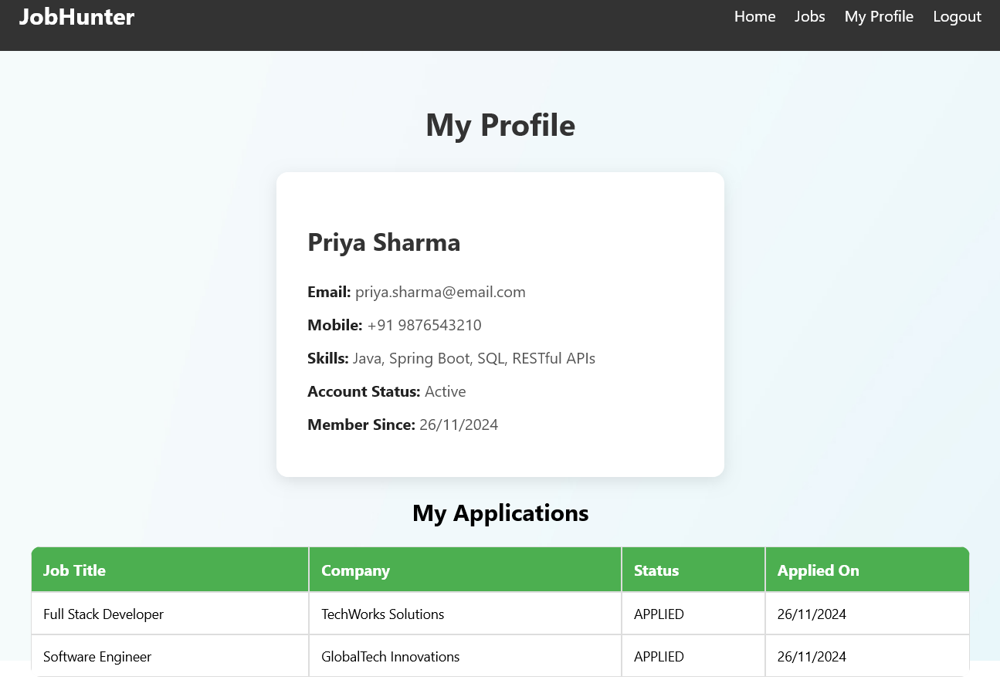
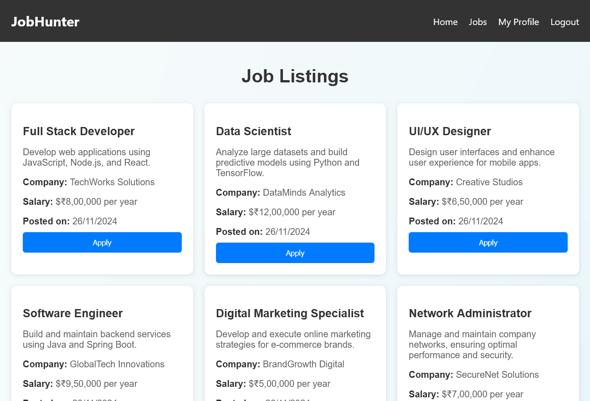
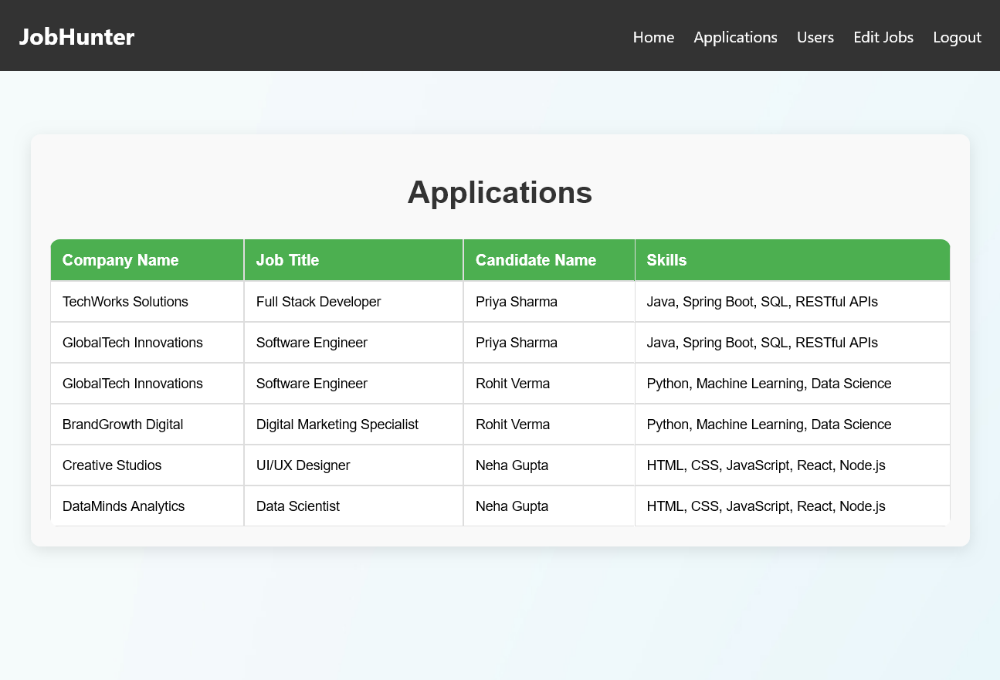
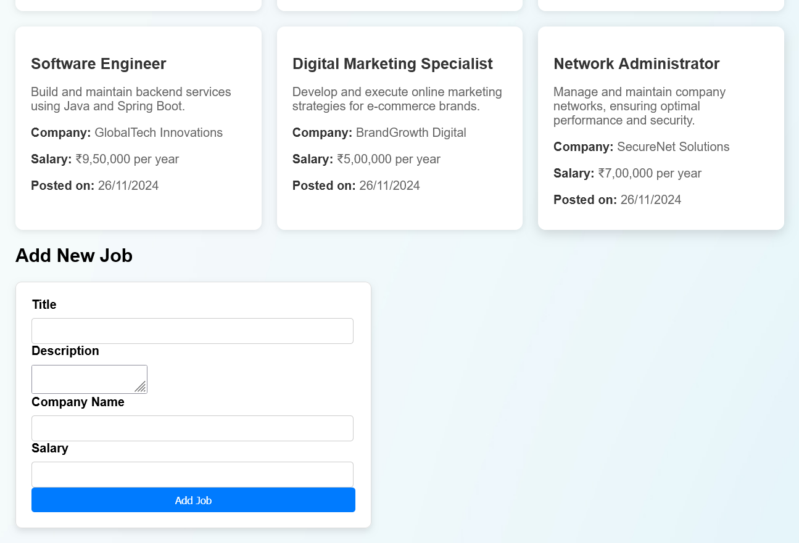

# **JobHunter: Spring Boot + React**

**JobHunter** is a full-stack web application designed as a job portal, offering users the ability to search for jobs, apply to them, and manage their profiles. The platform is divided into two main parts: a **React-based frontend** for the user interface and a **Spring Boot backend** that handles business logic and data management.

### Key Features:
- **Job Listings**: Browse available job opportunities and filter them by category.
- **User Profile**: Create and manage a personalized profile with contact details and resume.
- **Job Application**: Apply to job listings directly through the portal.
- **Admin Panel**: Admins can manage job listings and view applications.
- **User Registration & Authentication**: Secure login and registration with JWT authentication.

---

## **UML Diagram**

Below is the UML diagram that illustrates the architecture and relationships of the **JobHunter** application:



---

## **Screenshots**

#### 1. **Home Page**



#### 2. **Login/Registration Page**

 

#### 3. **User Pages**

 

#### 4. **Admin Panel**

 

---

## **Project Structure**

- **Frontend**: React app located in the `/frontend` directory.
- **Backend**: Spring Boot API located in the `/backend` directory.

---

## **Requirements**

Before you start setting up the project, ensure that the following software is installed:

- **Java 21+** for running the Spring Boot backend
- **Node.js 14+** for managing the frontend and React development

---

## **Setup Instructions**

### 1. **Clone the Repository**

Clone the repository to your local machine using Git:

```bash
git clone https://github.com/AshishJii/JobHunter.git
cd JobHunter
```

### 2. **Setting up the Frontend**

#### Install dependencies for React:

Navigate to the `frontend` directory and install the necessary Node.js dependencies:

```bash
cd frontend
npm install
```

#### Run the React development server:

Start the React development server by running:

```bash
npm start
```

Your React app will be running at [http://localhost:3000](http://localhost:3000).

### 3. **Setting up the Backend**

#### Install dependencies for Spring Boot:

Navigate to the `backend` directory and use Maven to install the required dependencies:

```bash
cd backend
mvn clean install
```

#### **Environment Variables**

Open the `application.properties` file located [here](./backend/src/main/resources/application.properties) and update your configurations:

```properties
spring.datasource.url=jdbc:mysql://localhost:3306/<database_name>
spring.datasource.username=<your_username>
spring.datasource.password=<your_password>
# create a folder named uploads
upload.dir=C:/path/to/your/uploads/folder/
```

#### Run the Spring Boot application:

Run the backend using the following command:

```bash
mvn spring-boot:run
```

Your Spring Boot API will be available at [http://localhost:8080](http://localhost:8080).

---


---

## **API Documentation**

This project exposes various APIs for managing job listings and applications. The API documentation is automatically generated with **Swagger**.

You can access the Swagger UI at:

```
http://localhost:8080/swagger-ui/index.html
```

---

## **Contributing**

We welcome contributions to improve and expand the functionality of **JobHunter**. If you wish to contribute, follow these steps:

1. Fork the repository to your GitHub account.
2. Create a new branch for your feature or bugfix.
3. Commit your changes to that branch.
4. Push your changes to your fork and create a pull request to the main repository.

---

## **License**

This project is licensed under the MIT License. For details, see the [LICENSE](LICENSE) file.
